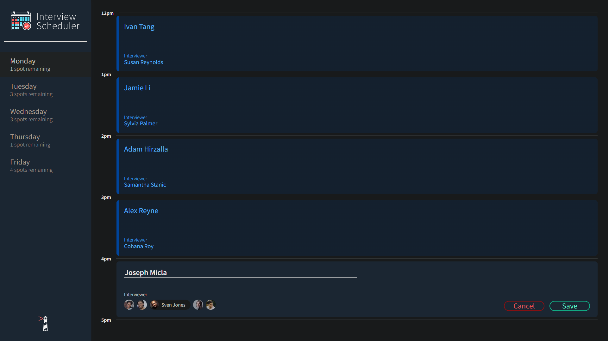
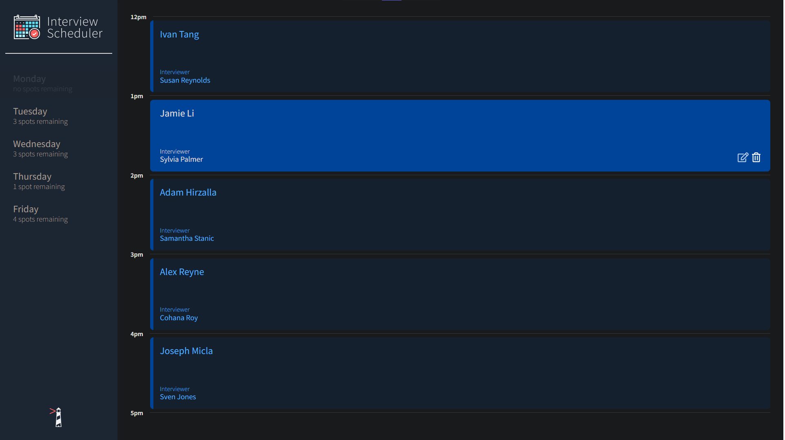
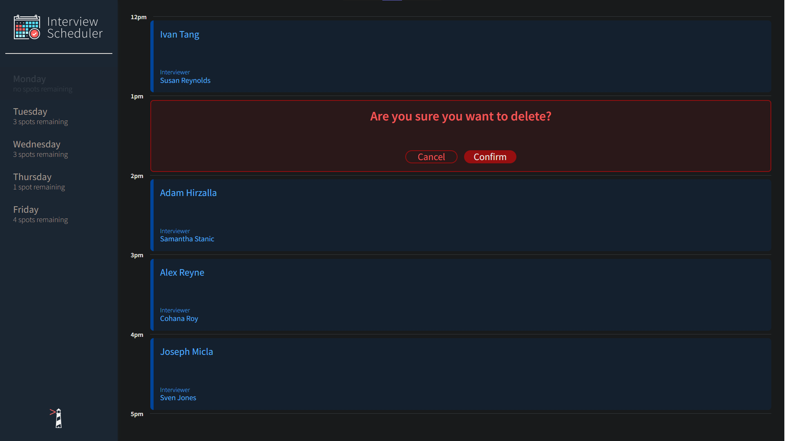
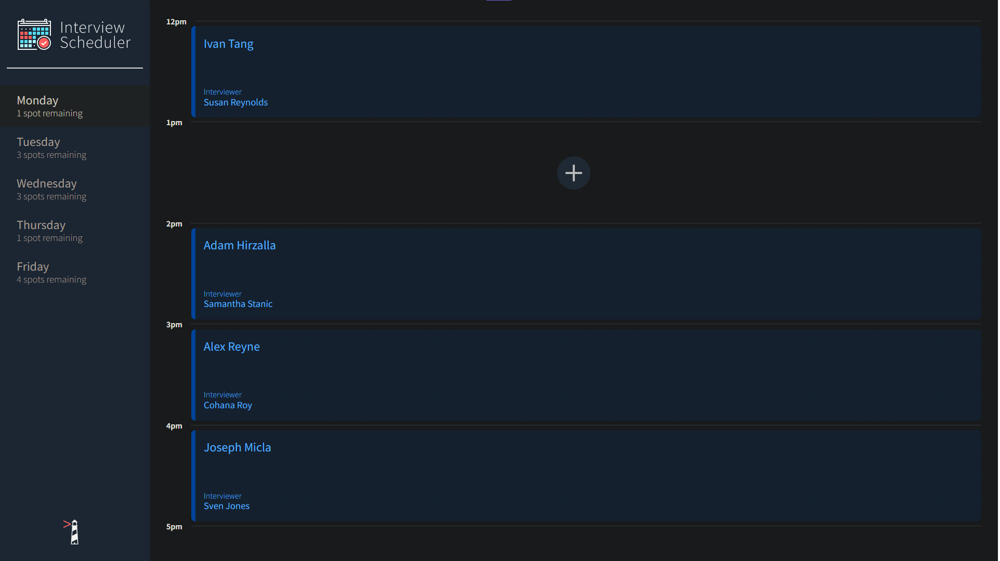

<h1 align="center">Interview Scheduler</h1>

## Table Of Contents

- [Summary](#summary)
  - [Features](#features)
  - [Screenshots](#screenshots)
- [Getting Started](#getting-started)
  - [Setup](#setup)
    - [Running Dev Server](#running-webpack-development-server)
    - [Running Jest](#running-jest-test-framework)
    - [Running Storybook](#running-storybook-visual-testbed)
- [About](#about)
  - [Frameworks and Libraries](#frameworks-and-libraries)
  - [Purpose](#purpose)

# Summary

Interview Scheduler is a **Single-Page Application (SPA)** that heavily relies on **React.js**.

## Features

Users can:

- Book appointments for Monday - Friday
- Book appointments with a specific interviewer
- Edit existing appointments
- Cancel existing appointments

## Screenshots






# Getting Started

## Setup

Install dependencies with `npm install`.

Note: this project requires [Lighthouse Labs' Api](https://github.com/lighthouse-labs/scheduler-api) server made specifically for this project

### Running Webpack Development Server

```sh
npm start
```

Server should be hosted on `http://localhost:8000/`

### Running Jest Test Framework

```sh
npm test
```

### Running Storybook Visual Testbed

```sh
npm run storybook
```

## Dependencies

- axios: ^0.24.0
- classnames: ^2.2.6
- normalize.css: ^8.0.1
- react: ^16.9.0
- react-dom: ^16.9.0
- react-scripts: 3.0.0
- @testing-library/react-hooks: ^7.0.2
- react-test-renderer: ^16.9.0
  - Note: react-test-rendered must be the same version as React
  - ` npm install --save-dev react-test-renderer@^16.9.0`

# About

## Frameworks and Libraries

- React
- Jest
- Storybook
- Cypress

## Purpose

This application is created as a part of **Lighthouse Labs' Web Development Bootcamp** curriculum.

Its purpose is to practice creating React components, managing state based user interfaces, unit testing, integration testing, and end-to-end testing.

As a front-end focused project, this communicates with a separate instance of an API to interact with data.
